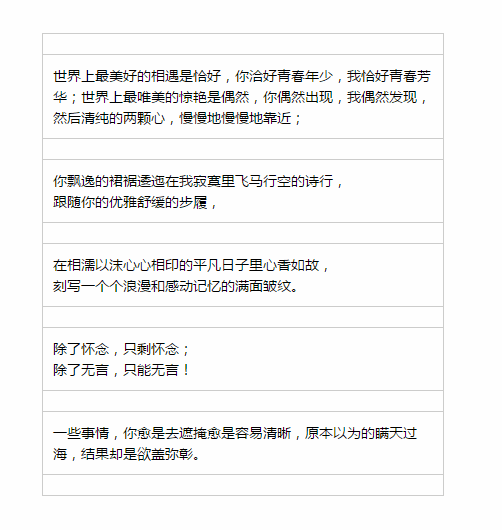

# DDSort

一个轻简的jQuery拖放排序插件。

##### ● 漂亮的UI展示：

##### ● 使用方法：

1、假设Html结构如下：

	

		<ul>
			<li>...</li>
			<li>...</li>
			...
		</ul>
	

2、依次引入jquery.js和ddsort.js，然后使用DDSort API实现如图拖放排序效果：

	$( '#wrap' ).DDSort({
		target: 'li',			//示例而用，默认即'li'
		floatStyle: {			//示例二用，默认有一定的样式
			'border': '1px solid #ccc',
			'background-color': '#fff'
		}
	});
3、如果拖放列表带有滚动条，那么$( '#wrap' )要是这个滚动条的元素。

##### ● 详细API
> DDSort方法接受一个JSON对象类型的参数，以下是对这个参数的描述。

<table width="65%" cellspacing="0" style="border-collapse: collapse;">
<tbody>
	<tr style="background-color: ##F3F3F3;">
		<td>参数列表</td>
		<td>类型</td>
		<td>描述</td>
	</tr>
	<tr>
		<td>target</td>
		<td>string</td>
		<td>可选，插件内部使用的是jQuery的on方法绑定的事件，此参数就是on方法上的选择器字符串，默认'li'</td>
	</tr>
	<tr>
		<td>cloneStyle</td>
		<td>object</td>
		<td>可选，设置占位符元素的样式</td>
	</tr>
	<tr>
		<td>floatStyle</td>
		<td>object</td>
		<td>可选，设置拖动元素的样式</td>
	</tr>
	<tr>
		<td>down</td>
		<td>function</td>
		<td>可选，鼠标按下时执行的函数</td>
	</tr>
	<tr>
		<td>move</td>
		<td>function</td>
		<td>可选，鼠标移动时执行的函数</td>
	</tr>
	<tr>
		<td>up</td>
		<td>function</td>
		<td>可选，鼠标抬起时执行的函数</td>
	</tr>
</tobdy>
</table>

